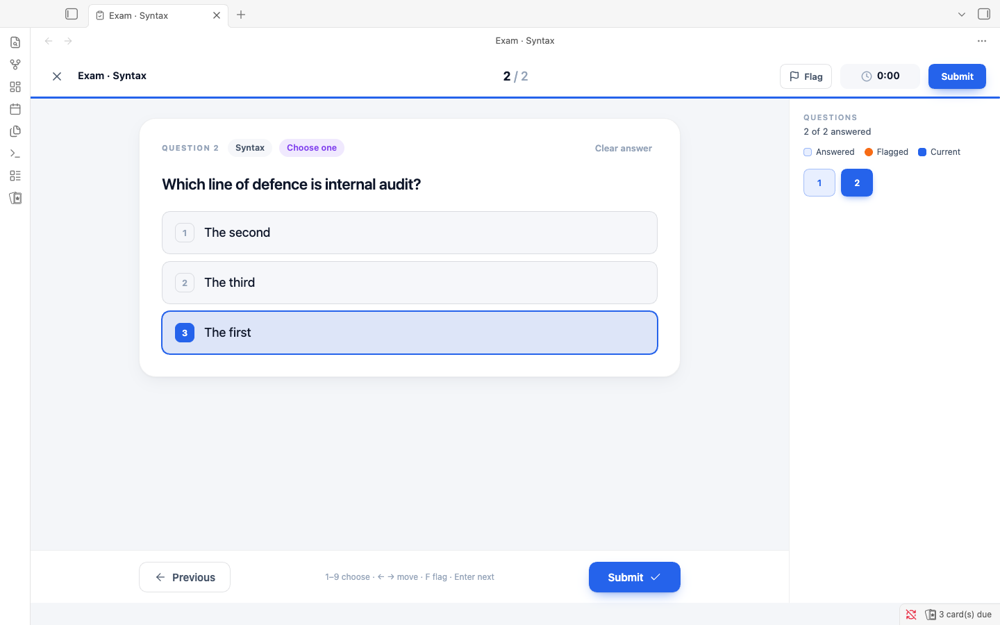
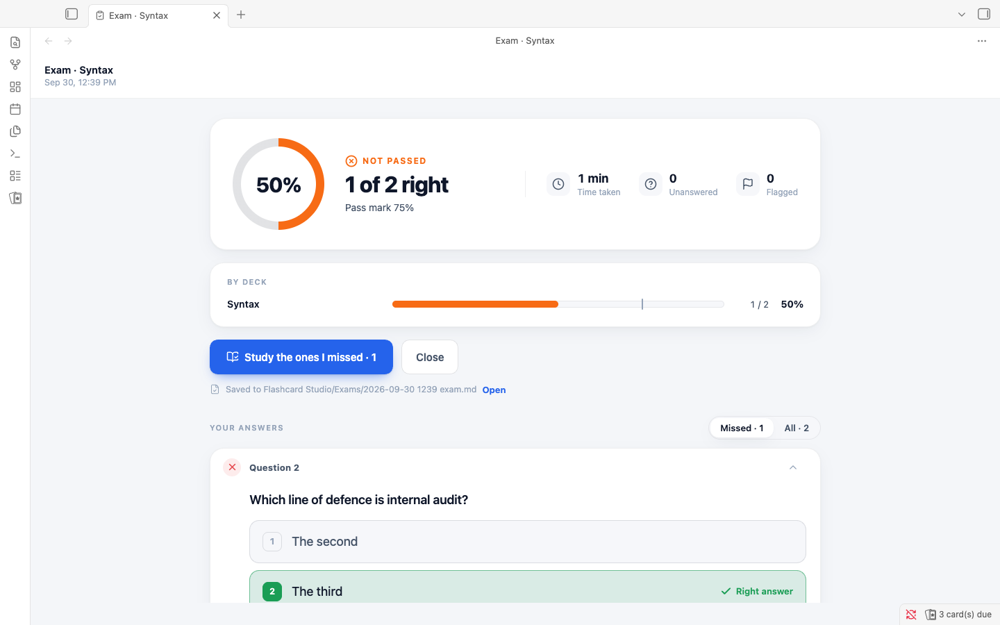

# Flashcard Studio

**Flashcards that live in your notes, with the scheduling and control you know from Anki, and a study screen made for focus.**

<picture>
  <source media="(prefers-color-scheme: dark)" srcset="docs/media/hero-dark.png">
  
</picture>

Flashcard Studio turns the Markdown you already write into spaced repetition flashcards, and schedules them with [FSRS](https://github.com/open-spaced-repetition/fsrs4anki/wiki/The-Algorithm), the modern algorithm Anki uses. It keeps a full review history, so you can undo an answer and see how your memory is doing. Every card and every review stays in plain files in your vault, and it works the same on desktop and on your phone.

> Flashcard Studio is a fork of [Spaced Repetition](https://github.com/st3v3nmw/obsidian-spaced-repetition) by Stephen Mwangi, maintained by Kyle Klus. It keeps that plugin's card syntax and schedule format, so your existing cards work unchanged, and you can switch back at any time. See [Credits](#credits).

## Highlights

- **A study screen made for focus.** One card at a time, with the deck and "4 / 17" at the top and a progress bar that fills with the colour of each answer you give. Tap to reveal, then answer with soft tiles that show when you will see the card again.
- **Know where you are weak.** The statistics rank your decks by how well you remembered them in the last 30 days, against your target, and the home screen puts the weakest one first with one tap to study it.
- **Fix mistakes while they are fresh.** At the end of a session, **Review mistakes** goes over exactly the cards you missed.
- **Practise like the real thing.** Timed exams from your multiple choice cards, with a question map, a score against your pass mark and the score of each deck, and one tap to study what you missed.
- **Anki's scheduling.** FSRS with learning steps, Anki's learn ahead limit, daily limits, custom study, and an optimizer that fits FSRS to your own reviews.
- **Full control.** Undo, suspend, bury, flags and leeches, and a card info screen with every review of a card.
- **Cards written for you.** Generate cards from a note with your own AI provider (Anthropic, OpenAI or a local model), look them over, and add only the ones you want.
- **Bring your Anki decks.** Import `.apkg` and text files with their media and decks, and export back to Anki.
- **Your data stays yours.** Cards and schedules are plain text in your notes, and the review history is plain files that sync between devices without conflicts.
- **Light and dark, desktop and phone.**

<picture>
  <source media="(prefers-color-scheme: dark)" srcset="docs/media/screenshots/statistics-desktop.png">
  
</picture>

## Compared with Spaced Repetition

|                                                      | Spaced Repetition | Flashcard Studio |
| ---------------------------------------------------- | ----------------- | ---------------- |
| Cards written in plain Markdown                      | ✓                 | ✓                |
| FSRS scheduling                                      | ✓                 | ✓                |
| Works on iPhone, iPad and Android                    | ✓                 | ✓                |
| Review history of every answer                       |                   | ✓                |
| Undo last answer                                     |                   | ✓                |
| Daily new card and review limits                     |                   | ✓                |
| Suspend, bury and flag cards; leech detection        |                   | ✓                |
| FSRS learning steps, learn ahead limit and optimizer |                   | ✓                |
| Custom study (forgotten, ahead, preview, by deck)    |                   | ✓                |
| Heatmap, true retention, study time and weak areas   |                   | ✓                |
| Review mistakes after a session                      |                   | ✓                |
| Exams with a timer, a score and results to study     |                   | ✓                |
| Import from and export to Anki                       |                   | ✓                |
| Sync without conflicts across devices                |                   | ✓                |

## Writing cards

Tag a note with `#flashcards`, or turn folders into decks in the settings. Then write cards in any of these styles:

```markdown
What is the capital of France::Paris

Question and answer both ways:::Reversed card

**What is the purpose of internal auditing?**
?

- Provide independent, objective assurance and consulting
- Add value and improve an organisation's operations

The CAE reports ==functionally== to the ==board==.

> [!question]- What is the capital of France?
> Paris
```

- `Question::Answer`: single-line card.
- `Question:::Answer`: single-line card, reviewed in both directions.
- `?` on its own line: multi-line card (`??` for both directions).
- `==highlight==`, `**bold**` or `{{curly braces}}`: cloze deletions.
- A callout of type `flashcard`, `question` or `card`: a card. The title is the front and the body is the back.
- With a start and an end marker set in the settings (for example `+++` on the line before and after a card), a card can
  have blank lines, tables and several paragraphs, also in its question.
- Two more options in the settings: a cloze card that is only the line with the cloze, and `\cloze{answer}{hint}` for
  clozes inside LaTeX math.

Images, audio, LaTeX, code and footnotes work inside cards, because Obsidian renders them.

## Reviewing

Run **Flashcard Studio: Review flashcards from all notes** from the command palette, or click the ribbon icon. Rate each card **Again**, **Hard**, **Good** or **Easy**. After an answer, a toast shows when you will see the card again, with an **Undo** button.

| Key                | Action                                                   |
| ------------------ | -------------------------------------------------------- |
| Space or Enter     | Show answer, then Good                                   |
| 1, 2, 3, 4         | Again, Hard, Good, Easy (Anki keys)                      |
| Ctrl/Cmd + Z, or U | Undo last answer                                         |
| -                  | Bury until tomorrow                                      |
| @                  | Suspend                                                  |
| Ctrl/Cmd + 1 to 7  | Flag (red, orange, green, blue, pink, turquoise, purple) |
| S                  | Skip                                                     |

The number keys follow **Answer keys** in the settings. **Anki** (1 Again, 2 Hard, 3 Good, 4 Easy) is the default for new installs. **Original** (1 Hard, 2 Good, 3 Easy, 0 Reset the card) is the layout of the original Spaced Repetition plugin, and existing installs keep it until you change the setting.

On a phone, the same actions are in the card menu.

### Multiple choice

A card whose answer is a task list with at least two items, at least one of them checked, is a multiple choice card. No new syntax:

<!-- prettier-ignore -->
```markdown
Which body sets the internal audit charter?
?
- [ ] The CAE
- [x] The board
- [ ] External auditors
- [ ] Senior management
Explanation: the board approves the charter (Standard 6.2).
```

Lines after the list are the explanation, shown after you answer. Text before the list stays above the options. In Spaced Repetition, the original plugin, this is an ordinary card, so your notes keep working there.

In a review the options are tiles. Tap one, or press its number (1 to 9), and the answer shows with the right option in green, a wrong choice in red, and the explanation. The rating the answer suggests, **Good** for a right choice and **Again** for a wrong one, is outlined and tagged **Suggested**; you still choose the rating. With several checked options the question says **Select all that apply**; choose them and press **Check**. To see the answer without choosing, press Space or tap the question, and nothing is suggested. **Shuffle options** in the settings (on by default) shows the options in a new order each time.

Only a real checklist counts. A list with one item, with nothing checked, with nested items or a plain bullet among the items, or a second list after other text, stays an ordinary card.

Multiple choice works with `?`, which is one direction. With `??` you get a second card as well: its front is the checklist, shown as an ordinary list of checkboxes, and its back is the question.

### Typing the answer

Turn on **Type the answer** in the settings, or **Type answers** in the card menu for one session. A card whose answer is short plain text (one line, at most 120 characters, no image, code, math, table or list) shows a field under the question. Press Enter to check. You see what you typed with each wrong letter marked, and the expected answer below it with the letters you left out marked. **Good** is suggested for an exact answer and **Again** otherwise. Case, extra spaces and a full stop at the end do not count, and accents do unless you turn on **Ignore accents**.

Cloze cards get a field in place of each blank, and the same rules mark them right or wrong. That part follows the setting; the card menu switch does not change it.

### Read aloud

The speaker button in the card, or the **R** key, reads the side you see with your device's own voices, offline. Images, code and math are skipped, and a cloze blank is read as "blank". A multiple choice card reads its options, and after you answer, the right one and the explanation. In the settings you can read the question or the answer aloud as soon as it shows, and choose the voice and the speed. Where a device cannot speak, the button and the settings are not shown.

## Exams

Run **Flashcard Studio: Take an exam** from the command palette, press **Take an exam** on the home screen, or choose **Exams** in the desktop sidebar. Choose the decks, the number of questions, a time limit (or none) and which cards to ask: **Multiple choice only**, or **All cards**, where a card with a short plain answer is typed and any other card is one you mark yourself after looking at the answer. Two presets fill it in: **Quick check** (20 questions, no limit) and **CIA simulation** (125 questions, 150 minutes). Cloze cards and suspended cards are never asked, and an exam never changes the schedule of a card.

The exam shows one question at a time, with "12 / 125" and the time left at the top. The time turns orange under five minutes, and the exam is submitted when it reaches zero. Flag a question to come back to it. The question map, beside the question on a desktop and a sheet from the bottom on a phone, shows what is answered and what is flagged, and jumps to any question. Press 1 to 9 to choose an option, the left and right arrows to move, F to flag and Enter to go on. **Submit** asks first, and says how many questions are unanswered or flagged.

<picture>
  <source media="(prefers-color-scheme: dark)" srcset="docs/media/screenshots/exam-question-desktop.png">
  
</picture>

The results show your score against the pass mark, the time taken, the score of each deck, and every question with your answer, the right one and the explanation. The pass mark is 75% until you change it in **Settings, Exams**. The CIA reports a scaled score, so this is a practice target, not the official pass mark. **Study the ones I missed** starts a review of exactly those cards, and a question left unanswered counts as missed.

<picture>
  <source media="(prefers-color-scheme: dark)" srcset="docs/media/screenshots/exam-results-desktop.png">
  
</picture>

Each exam is saved as one plain file in `Flashcard Studio/Exams/`, for example `2026-09-30 1405 exam.md`: a summary table, and one JSON line for each question. The setup lists your last five exams and starts from the last one, so a retake is one press of **Start exam**.

## AI cards

Run **Flashcard Studio: Generate cards with AI** from the command palette, or choose it in the editor's context menu, on a note or on a selection. Choose how many cards (up to 50), which kinds (basic, reversed, cloze, multiple choice), any extra instructions, and whether the cards go into this note, under a **Flashcards** heading, or into a new note next to it. A preview lists the cards: untick the ones you do not want, edit any text, then choose **Add**. The plugin writes the cards in your notes' own syntax and reads each one back with its own parser before adding it. A card that would not read back as itself, for example one with `::` in its question, is shown unticked with the reason, until you edit it. A note without a flashcards tag gets one.

<picture>
  <source media="(prefers-color-scheme: dark)" srcset="docs/media/screenshots/ai-preview-desktop.png">
  
</picture>

Set it up in **Settings, AI cards**: pick Anthropic, OpenAI or any OpenAI-compatible server such as Ollama, LM Studio or OpenRouter (enter its address, for example `http://localhost:11434/v1`), a model name and your API key. The key is kept in Obsidian's secret storage, not in the plugin's settings file. A local server needs no key. This needs Obsidian 1.11.4 or later.

Many local servers cut a long note short without saying so (Ollama's default context is 4096 tokens), so raise the context length there when you generate from long notes.

## Where your data lives

- **The schedule of each card** is an HTML comment after the card: `<!--SR:!fsrs,...,id=k3f9a2-->`. It is the same format the original plugin uses, plus a short card id and optional markers (`susp`, `bury=`, `flag=`, `leech`) that the original plugin ignores.
- **Your review history** is in `Flashcard Studio/Review log/`, with one Markdown file per device per month (for example `2026-09 iphone-81c2.md`). Each answer is one line of JSON. Because every device writes only its own files, syncing with Obsidian Sync, iCloud or any other service never creates conflicts.
- **Your exams** are in `Flashcard Studio/Exams/`, one Markdown file each. Like the review log, they are never read as cards.
- **Settings** are in the plugin's `data.json`.

These plain files make it easy for scripts or AI assistants to read your progress and add cards.

## Installing

Until Flashcard Studio is in the community plugin directory, install it with [BRAT](https://github.com/TfTHacker/obsidian42-brat):

1. Install and enable **BRAT** from the community plugins.
2. Run **BRAT: Add a beta plugin for testing** and enter `Almalkiid/flashcard-studio`.
3. Enable **Flashcard Studio** in the community plugins.

**Coming from Spaced Repetition?** Disable it and enable Flashcard Studio. Your cards and schedules work as they are. To keep your settings, use **Settings, Data, Import settings from Spaced Repetition**.

## Network use

Flashcard Studio works offline. It makes a network request only in two cases:

- You turn on **Show update available status bar item** in the settings, which checks this repository's latest release on GitHub.
- You run **Generate cards with AI**, which sends the note or selection you chose, and your extra instructions, to the provider you set up in the settings. Nothing is sent until you choose **Generate**.

## Credits

Flashcard Studio is built on [Spaced Repetition](https://github.com/st3v3nmw/obsidian-spaced-repetition) by **Stephen Mwangi** (original author) and **Kyle Klus** (maintainer), and on the work of its many contributors and translators. Their plugin's history is kept in this repository.

It includes fixes that community members contributed to the original plugin but that were not merged yet:

- #1629 by mayuriphad
- #1631 by Rainbow-prince
- #1601 by Gwyndolin
- #1610 by Kian Kyars
- #1587 by Lorite
- #1623 by Sheldon Corkery
- #1635 by paulclrt

The card syntax owes the following to pull requests that were not merged into the original plugin:

- #1652 by xiang2x: card regions with a start marker.
- #1584 by ievlevpn: `\cloze{answer}{hint}` in LaTeX math.
- #797 by Stefanuk12: a cloze card that is only the line with the cloze.
- #1283: the idea of callout cards.

The prompt of **Generate cards with AI** is adapted from [obsidian-flashcards-llm](https://github.com/crybot/obsidian-flashcards-llm) by crybot (MIT).

Scheduling uses [ts-fsrs](https://github.com/open-spaced-repetition/ts-fsrs) by the Open Spaced Repetition project.

## License

MIT. See [LICENSE](LICENSE).
