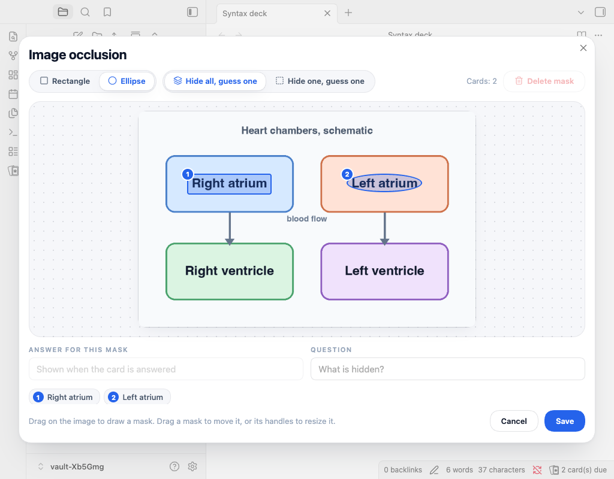

# Flashcard Studio

**Flashcards that live in your notes, with the scheduling and control you know from Anki, and a study screen made for focus.**

<picture>
  <source media="(prefers-color-scheme: dark)" srcset="docs/media/hero-dark.png">
  
</picture>

Flashcard Studio turns the Markdown you already write into spaced repetition flashcards, and schedules them with [FSRS](https://github.com/open-spaced-repetition/fsrs4anki/wiki/The-Algorithm), the modern algorithm Anki uses. It keeps a full review history, so you can undo an answer and see how your memory is doing. Every card and every review stays in plain files in your vault, and it works the same on desktop and on your phone.

> Flashcard Studio is a fork of [Spaced Repetition](https://github.com/st3v3nmw/obsidian-spaced-repetition) by Stephen Mwangi, maintained by Kyle Klus. It keeps that plugin's card syntax and schedule format, so your existing cards work unchanged, and you can switch back at any time. See [Credits](#credits).

## Highlights

- **A study screen made for focus.** One card at a time, with the deck and "4 / 17" at the top and a progress bar that fills with the colour of each answer you give. Tap to reveal, then answer with soft tiles that show when you will see the card again.
- **Know where you are weak.** The statistics rank your decks by how well you remembered them in the last 30 days, against your target, and the home screen puts the weakest one first with one tap to study it.
- **Fix mistakes while they are fresh.** At the end of a session, **Review mistakes** goes over exactly the cards you missed.
- **Anki's scheduling.** FSRS with learning steps, Anki's learn ahead limit, daily limits, custom study, and an optimizer that fits FSRS to your own reviews.
- **Full control.** Undo, suspend, bury, flags and leeches, and a card info screen with every review of a card.
- **Bring your Anki decks.** Import `.apkg` and text files with their media and decks, and export back to Anki.
- **Your data stays yours.** Cards and schedules are plain text in your notes, and the review history is plain files that sync between devices without conflicts.
- **Light and dark, desktop and phone.**

<picture>
  <source media="(prefers-color-scheme: dark)" srcset="docs/media/screenshots/statistics-desktop.png">
  
</picture>

## Compared with Spaced Repetition

|                                                      | Spaced Repetition | Flashcard Studio |
| ---------------------------------------------------- | ----------------- | ---------------- |
| Cards written in plain Markdown                      | ✓                 | ✓                |
| FSRS scheduling                                      | ✓                 | ✓                |
| Works on iPhone, iPad and Android                    | ✓                 | ✓                |
| Review history of every answer                       |                   | ✓                |
| Undo last answer                                     |                   | ✓                |
| Daily new card and review limits                     |                   | ✓                |
| Suspend, bury and flag cards; leech detection        |                   | ✓                |
| FSRS learning steps, learn ahead limit and optimizer |                   | ✓                |
| Custom study (forgotten, ahead, preview, by deck)    |                   | ✓                |
| Heatmap, true retention, study time and weak areas   |                   | ✓                |
| Review mistakes after a session                      |                   | ✓                |
| Import from and export to Anki                       |                   | ✓                |
| Sync without conflicts across devices                |                   | ✓                |

## Writing cards

Tag a note with `#flashcards`, or turn folders into decks in the settings. Then write cards in any of these styles:

```markdown
What is the capital of France::Paris

Question and answer both ways:::Reversed card

**What is the purpose of internal auditing?**
?

- Provide independent, objective assurance and consulting
- Add value and improve an organisation's operations

The CAE reports ==functionally== to the ==board==.

> [!question]- What is the capital of France?
> Paris
```

- `Question::Answer`: single-line card.
- `Question:::Answer`: single-line card, reviewed in both directions.
- `?` on its own line: multi-line card (`??` for both directions).
- `==highlight==`, `**bold**` or `{{curly braces}}`: cloze deletions.
- A callout of type `flashcard`, `question` or `card`: a card. The title is the front and the body is the back.
- With a start and an end marker set in the settings (for example `+++` on the line before and after a card), a card can
  have blank lines, tables and several paragraphs, also in its question.
- Two more options in the settings: a cloze card that is only the line with the cloze, and `\cloze{answer}{hint}` for
  clozes inside LaTeX math.

Images, audio, LaTeX, code and footnotes work inside cards, because Obsidian renders them.

### Image occlusion

Hide parts of a picture and guess what is under them, which is how you learn a diagram, a map or an anatomy plate.

<picture>
  <source media="(prefers-color-scheme: dark)" srcset="docs/media/screenshots/occlusion-editor-desktop.png">
  
</picture>

Run **Add image occlusion** from the command palette, or from the editor menu, and choose an image from your vault. Drag on the picture to draw a rectangle or an ellipse, drag a mask to move it, drag its handles to resize it, and type what is under it in the answer field. It works with a mouse and with a finger. A mask smaller than 1% of the picture is ignored, and Delete removes the selected mask.

Saving writes a block into your note:

````markdown
```image-occlusion
image: [[Heart.png]]
mode: hide-all
question: Name the labelled chamber
mask: a1 rect 0.1250 0.3000 0.1800 0.0950 | Left ventricle
mask: b2 ellipse 0.5500 0.2200 0.1400 0.0800 |
```
````

- Every mask is one card. Coordinates are fractions of the picture, so the masks fit it at any size.
- **Hide all, guess one** (the default) draws every mask and asks about one at a time, as Anki does. **Hide one, guess one** draws only the mask that is asked about.
- On the front the mask that is asked about is filled and the others are grey. On the back it turns into an outline, and its answer is shown under the picture. The picture is as wide as the card, so what is written on it can be read, and the card scrolls to the mask that is asked about. Click or tap the picture to zoom.
- The schedules of the masks share one `<!--SR:...-->` comment after the block, like the deck of a cloze card. Editing a block in the editor moves each schedule with its mask: delete a mask and the others keep theirs, and a new mask starts as a new card.
- In a note, the block shows the picture with every answer on its mask and a pencil that reopens the editor. The original Spaced Repetition plugin sees a code block and no card.
- **Edit masks in the editor, not by hand, once a block has been reviewed.** Schedules follow the masks by their position in the block. The editor moves each schedule with its mask. If you delete or break a `mask:` line in the text, the schedules that come after it move onto the wrong masks. A block that has no image, or no mask that reads, is not a card, and its schedule comment is left as it is.
- The image is a link to a file, and Obsidian does not update links inside code blocks. If you rename or move the image, the card shows "Image not found" and keeps its schedule; change the `image:` line to the new name.
- **Edit card** in the study screen opens the same editor with the masks locked: you can move and resize them, change their answers and the question, but not add or delete a mask, because the cards of the block are in the queue. Add or delete masks from the note.
- Anki has no such card in its basic model, so an export writes one basic note per mask, with the question and the whole picture on the front and the answer on the back.

## Reviewing

Run **Flashcard Studio: Review flashcards from all notes** from the command palette, or click the ribbon icon. Rate each card **Again**, **Hard**, **Good** or **Easy**. After an answer, a toast shows when you will see the card again, with an **Undo** button.

| Key                | Action                                                   |
| ------------------ | -------------------------------------------------------- |
| Space or Enter     | Show answer, then Good                                   |
| 1, 2, 3, 4         | Again, Hard, Good, Easy (Anki keys)                      |
| Ctrl/Cmd + Z, or U | Undo last answer                                         |
| -                  | Bury until tomorrow                                      |
| @                  | Suspend                                                  |
| Ctrl/Cmd + 1 to 7  | Flag (red, orange, green, blue, pink, turquoise, purple) |
| S                  | Skip                                                     |

The number keys follow **Answer keys** in the settings. **Anki** (1 Again, 2 Hard, 3 Good, 4 Easy) is the default for new installs. **Original** (1 Hard, 2 Good, 3 Easy, 0 Reset the card) is the layout of the original Spaced Repetition plugin, and existing installs keep it until you change the setting.

On a phone, the same actions are in the card menu.

## Where your data lives

- **The schedule of each card** is an HTML comment after the card: `<!--SR:!fsrs,...,id=k3f9a2-->`. It is the same format the original plugin uses, plus a short card id and optional markers (`susp`, `bury=`, `flag=`, `leech`) that the original plugin ignores.
- **Your review history** is in `Flashcard Studio/Review log/`, with one Markdown file per device per month (for example `2026-09 iphone-81c2.md`). Each answer is one line of JSON. Because every device writes only its own files, syncing with Obsidian Sync, iCloud or any other service never creates conflicts.
- **Settings** are in the plugin's `data.json`.

These plain files make it easy for scripts or AI assistants to read your progress and add cards.

## Installing

Until Flashcard Studio is in the community plugin directory, install it with [BRAT](https://github.com/TfTHacker/obsidian42-brat):

1. Install and enable **BRAT** from the community plugins.
2. Run **BRAT: Add a beta plugin for testing** and enter `Almalkiid/flashcard-studio`.
3. Enable **Flashcard Studio** in the community plugins.

**Coming from Spaced Repetition?** Disable it and enable Flashcard Studio. Your cards and schedules work as they are. To keep your settings, use **Settings, Data, Import settings from Spaced Repetition**.

## Network use

Flashcard Studio works offline. It makes no network requests unless you turn on **Show update available status bar item** in the settings, which checks this repository's latest release on GitHub.

## Credits

Flashcard Studio is built on [Spaced Repetition](https://github.com/st3v3nmw/obsidian-spaced-repetition) by **Stephen Mwangi** (original author) and **Kyle Klus** (maintainer), and on the work of its many contributors and translators. Their plugin's history is kept in this repository.

It includes fixes that community members contributed to the original plugin but that were not merged yet:

- #1629 by mayuriphad
- #1631 by Rainbow-prince
- #1601 by Gwyndolin
- #1610 by Kian Kyars
- #1587 by Lorite
- #1623 by Sheldon Corkery
- #1635 by paulclrt

The card syntax owes the following to pull requests that were not merged into the original plugin:

- #1652 by xiang2x: card regions with a start marker.
- #1584 by ievlevpn: `\cloze{answer}{hint}` in LaTeX math.
- #797 by Stefanuk12: a cloze card that is only the line with the cloze.
- #1283: the idea of callout cards.

Scheduling uses [ts-fsrs](https://github.com/open-spaced-repetition/ts-fsrs) by the Open Spaced Repetition project.

## License

MIT. See [LICENSE](LICENSE).
